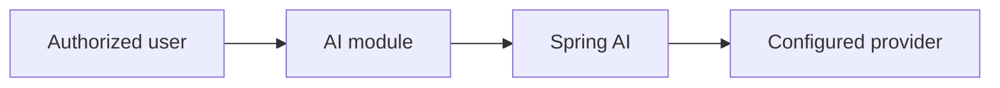

# AI architecture

AI is a VetOS module in the monolith, not a separate product and not a telephony system. Voice agents are out of scope.

Provider credentials come from configuration or Secrets Manager, not from source code.

## Rules

- Outputs are typed and validated before they are shown.
- Calls have a timeout, a retry policy, and a token or cost limit.
- Prompts include only the fields required for the task, stay inside the clinic, and avoid unnecessary identifiers.
- Logs store model, token counts, clinic id, and request id. They do not store the full clinical prompt by default.
- Tests use a deterministic fake provider.
- pgvector and retrieval are not added until a product requirement needs them.

## Clinical use

Suggestions are advisory. The application does not let the model write a diagnosis, prescription, invoice, stock movement, or outbound clinical message. A person with the right permission saves those records through the normal APIs.

The module is not implemented.
