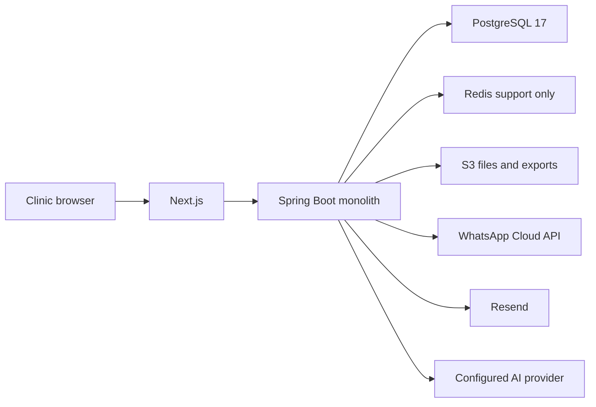

# System architecture

VetOS is one modular monolith plus one Next.js application. Clinics share one PostgreSQL database and one schema. `clinic_id` is the tenant boundary. PostgreSQL row-level security and application queries both enforce it.

The browser never chooses the tenant. The access token carries the clinic id taken from the user row at login. Each request transaction runs `set_config('app.clinic_id', ..., true)` before tenant queries.

External calls to WhatsApp, email, and AI happen after commit, from the transactional outbox. Those integrations are specified and not built.

Voice and telephony are out of scope.

## Deployment shape

Local: Docker Compose runs PostgreSQL, Redis, the API, and the web app.

Target production, not built: CloudFront where needed, Application Load Balancer, ECS in `ap-south-1`, RDS PostgreSQL, ElastiCache Redis, S3, Secrets Manager.

## Process model

One API process serves HTTP and, later, scheduled workers. ShedLock will keep scheduled jobs single-active across ECS tasks. Job claiming will use `FOR UPDATE SKIP LOCKED`. Workers must set tenant context from the job row, not from a thread-local copied off the web request.
