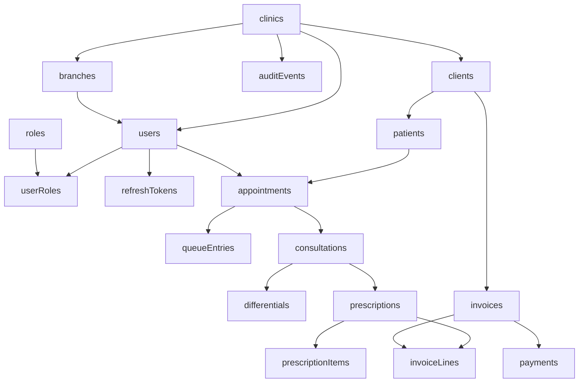

# Relationships

A patient references a client in the same clinic. An appointment references a patient, client, branch, and doctor user in the same clinic. A consultation references one appointment and one patient. A prescription references one consultation. An invoice line may reference a prescription item through `source_type` and `source_id` and also stores the snapshotted text and amounts. A payment references one invoice.

Issued financial rows are not cascaded away. Operational parent deletes are soft deletes, so historical foreign keys remain valid.
